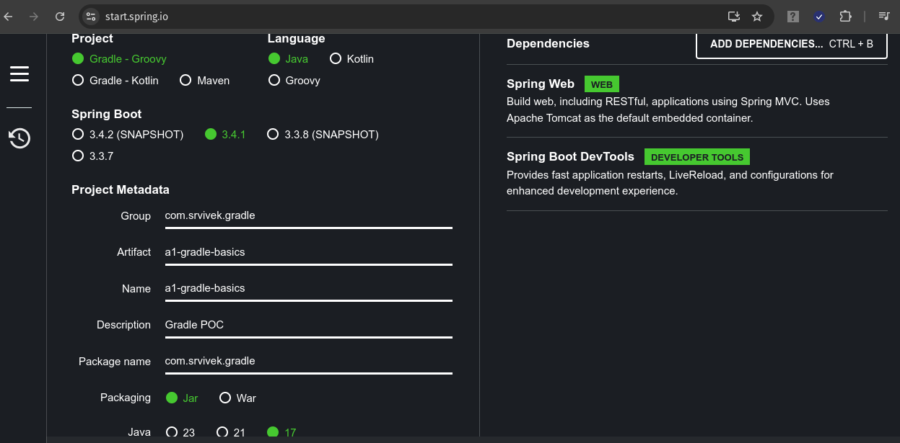

# Gradle (Build tool) basics
## 1. Gradle Introduction
- **<ins>About / Introduction</ins>**
  - Gradle is the open source build system of choice for Java, Android, and Kotlin developers. 
  - From mobile apps to microservices, from small startups to big enterprises, it helps teams deliver better software, faster.
  - It supports same project layout as Maven.
- **<ins>Features:</ins>**
  - **Build Anything:**
    - Write in Java, Kotlin, C++, or any language of your choice. Package for deployment on any platform.
    - Go monorepo or multi-repo. and rely on Gradle's unparalleled versatility to build it all.
  - **Automate Everything:** 
    - Completely programmable.
      - Support DSL (Domain specific language) *Groovy* *(used frequently)* and *Kotlin*.
    - Use Gradle's rich API and mature ecosystem of plugins and integrations to get ambitious about automation.
    - Model, integrate and systematize the delivery of your software from end to end.
  - **Deliver Faster:**
    - Balzing fast build, using advance strategies like
      - *Compile aviodance to advanced caching.*
      - *Can speed up Maven builds by upto 90%.*
        - **Incrementality:** It runs only what is necessary e.g. *Compiles only changed files*.
        - **Build Cache:** Reuses the build outputs of other gradle builds with same inputs.
    - Scale out development with elegant, blazing-fast builds. From compile avoidance to advanced caching and beyond, we pursue performance relentlessly so your team can deliver continuously.
- **<ins>References:</ins>**
  - [https://gradle.org/](https://gradle.org/)
---
## 2. Gradle setup [*TODO*]

---
## 3. Create First Gradle project
### Project ref: [a1-gradle-basics](a1-gradle-basics)
- **<ins>About / Introduction</ins>**
  - We can create new project with gradle using the *IDE New Project* option or we can use [https://start.spring.io/](https://start.spring.io/).
  - **Gradle Project using Spring portal**
    <center>
      
    </center>
  - **<ins>Note:</ins>**
    - Use Maven, if your build is simple (clean, install, test ....)
    - Use Gradle, if build taking too much time or you want to customize the build.
  - **Important Gradle Files:**
    - **build.gradle:**
      - Contains:
      - External dependencies for project.
      - Remote repositories to check for dependencies.
      - Tasks: *tasks.named('test')*, to define test platform.
      - **Note:**
        - At present *Eclipse doesn't support* auto download new dependency if added/updated in *build.gradle*.
        - To reload the change --> Right Click on Project --> Gradle --> Refresh Gradle Project.
    - **settings.gradle:**
      - Contains project name with key *rootProject.name* equivalent to *artifactId* in *pom.xml*.
        - *rootProject.name = 'a1-gradle-basics'*
      - Contains *PluginManagement* repositories.
  - **build.gradle: gradle plugins**
    - **java pluging:** *id 'java'*
      - Defines Java Compilation + Testing + Building capabilities.
        - **Default Layout:**
          - *Java Source:* `/src/main/java`
          - *Production resources:* `/src/main/resources` 
          - *Test Java Source:* `/src/test/java`
          - *Test resources:* `/src/test/resources` 
        - **Key Task:**
          - *build:* Help to build and create jars.
    - **Spring Boot Gradle Plugin:**
      - Packages executable Spring Boot jar.
      - Build container image (bootJar, bootBuildImage)
      - Use dependency management enabled by `spring-boot-dependencies`.
      - **Plugin:** *id 'org.springframework.boot' version '3.4.1'*
- **<ins>build.gradle</ins>**
    ```gradle
        plugins {
            id 'java'
            id 'org.springframework.boot' version '3.4.1'
            id 'io.spring.dependency-management' version '1.1.7'
        }

        group = 'com.srvivek.gradle'
        version = '0.0.1-SNAPSHOT'

        java {
            toolchain {
                languageVersion = JavaLanguageVersion.of(17)
            }
        }

        repositories {
            mavenCentral()
            maven {
                url 'https://repo.spring.io/milestone'
            }
        }

        dependencies {
            implementation 'org.springframework.boot:spring-boot-starter-web'
            developmentOnly 'org.springframework.boot:spring-boot-devtools'
            testImplementation 'org.springframework.boot:spring-boot-starter-test'
            testRuntimeOnly 'org.junit.platform:junit-platform-launcher'
        }

        tasks.named('test') {
            useJUnitPlatform()
        }
    ```
- **<ins>settings.gradle</ins>**
    ```gradle
        rootProject.name = 'a1-gradle-basics'
    ```
- **<ins>References:</ins>**
  - [https://www.javatpoint.com/gradle-repository](https://www.javatpoint.com/gradle-repository)
  - [https://medium.com/@andrewMacmurray/a-beginners-guide-to-gradle-26212ddcafa8](https://medium.com/@andrewMacmurray/a-beginners-guide-to-gradle-26212ddcafa8)

---


